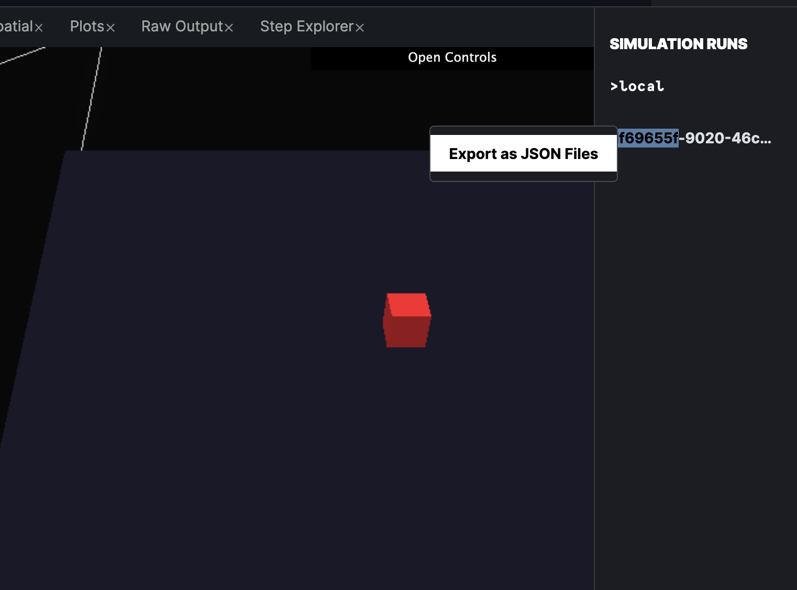

# Analysis

## What is Simulation Analysis?

When running a simulation using HASH, you describe a system of agents that interact with each other in a given environment. The result of the simulation is determined by many factors:

* the initial conditions
* the behaviors assigned to each agent
* randomness

While the simulation is running you may be able to glean insight from visually observing your model. To supplement this, HASH provides you with a **Plots** view that can allow you to learn more about your simulation. For instance:

* Is a certain variable converging upon a value? 
* What emergent phenomena are appearing? 
* How do stochasticity and the initial conditions affect the simulation run?

These are the kinds of questions you can answer with HASH's analysis capabilities. It allows you to define "outputs" which you can then plot. The **analysis.json** file is organized as a JSON object with two major properties, outputs and plots.



## Outputs

The **analysis.json** file contains two objects within it: "outputs" and "plots". Outputs is an object collection of JSON objects of the form:

```javascript
"outputs": {
    "feature_1": [
        {
            Operation
        },
        {
            Operation
        }
        ...
    ],
    "feature_2": [
    ...
    ]
}
```

The “feature” is an output of your simulation, represented as an array of data. For example, if you have a collection of agents with an age attribute, you might want to count the number over 50. You will chain together operations like so:

```javascript
   "over_fifty": [
   {
       "op": "filter",
       "field": "age",
       "comparison": "gte",
       "value": "50"
     },
     { "op": "count"}
   ],
```

It's likely that the most common operation you'll use is "filter". You can filter with numeric, boolean, and string values. The valid comparisons are listed below:

| Comparison Name | Comparison Description |
| :--- | :--- |
| eq | Equal to \(===\) |
| neq | Not equal to \(!==\) |
| lt | Less than \(&lt;\) |
| lte | Less than or equal to \(&lt;=\) |
| gt | Greater than \(&gt;\) |
| gte | Greater than or equal to \(&gt;=\) |

The other operations besides "filter" are listed below. Most of these operations are aggregators: they will reduce the current output array to a single value. In general, an output feature will contain a number of "filters", a "get" and an aggregator. Like many data pipelines you first filter your data to the set you're interested in, and then aggregate it into a final metric.

| Operator Name | Additional Arguments | Operator Description |
| :--- | :--- | :--- |
| filter | _field_, _comparison_, _value_ | Filter the current output with the given _comparison_ and _value_ on the given _field_  of each element |
| count | n/a | Count the number of agents in the current output |
| get | _field_ | Map the value from a field onto each element of the current output |
| sum | n/a | Sum over the elements of the current output |
| min | n/a | Return the minimum of the elements in the current output |
| max | n/a | Return the maximum of the elements in the current output |
| mean | n/a | Return the mean of the elements in the current output |

## Plots

The "plots" list contains collections which define the different plots that visualize the outputs. The basic configuration of a plot includes a title, data, type, layout, and position field:

```javascript
  "plots": [{
     "title": "title",
     "layout": {
       "width": "100%", // % of analysis view width
       "height": "50%" // % of analysis view height
     },
     "position": {
     //top left corner of plot
       "x": "0%",
       "y": "0%"
     },
     //type of chart
     "type": "timeseries", // "histogram", "barplot", etc...
     "data": [
       {
         "y": "component_1",
         "name": "component_1_name"
         // ...
       },
       {
         "y": "component_2_name",
         "name": "component_2_name"
         //...
       {
     ]
   },
   //...
   ]
```

By default the x-axis represents the step of the simulation. You can use line, bar, or area charts, among others.

As a shortcut you may replace the "data" and "type" field with a "timeseries" array. Any outputs you place in the array will be plotted as lines.

```javascript
"plots": [{
     "title": "title",
     "layout": { "width": "100%", "height": "50%" },
     "position": { "x": "0%", "y": "0%" },
     // Timeseries shortcut
     "timeseries": ["timeseries1", "timeseries2"]
}]
```

HASH uses Plotly behind the scenes to render charts and graphs. As such, the platform supports any valid value it supports for layout, type, and data as [documented in their API](https://plotly.com/javascript/reference/).

## Exporting Simulation Runs

You can save the data from any of your simulation runs by right clicking on an individual run and clicking export as JSON Files.



## Examples

Below are a few snippets of outputs and plots.

### [Model Market](https://core.hash.ai/@hash/model-market/4.4.1)

```javascript
{
   "outputs":{
      "recent_sales":[
         {
            "op":"filter",
            "field":"color",
            "comparison":"eq",
            "value":"green"
         },
         {
            "op":"count"
         }
      ],
      "no_recent_sales":[
         {
            "op":"filter",
            "field":"color",
            "comparison":"eq",
            "value":"skyblue"
         },
         {
            "op":"count"
         }
      ]
   },
   "plots":[
      {
         "title":"Shop Status",
         "timeseries":[
            "no_recent_sales",
            "recent_sales",
            "closed"
         ],
         "layout":{
            "width":"100%",
            "height":"40%"
         },
         "position":{
            "x":"0%",
            "y":"0%"
         }
      }
   ]
}
```

### Civil Unrest

```javascript
{
  "outputs": {
    "active": [
      {
        "op": "filter",
        "field": "active",
        "comparison": "eq",
        "value": true
      },
      { "op": "count" }
    ],
    "arrested": [
      {
        "op": "filter",
        "field": "jail_time",
        "comparison": "gt",
        "value": 0
      },
      { "op": "count" }
    ]
  },
  "plots": [
    {
      "title": "Active agents",
      "timeseries": ["active"],
      "layout": { "width": "100%", "height": "33%"},
      "position": { "x": "0%", "y": "0%"}
    },
    {
      "title": "Arrested agents",
      "timeseries": ["arrested"],
      "layout": { "width": "100%", "height": "33%"},
      "position": { "x": "0%", "y": "68%"}
    },
    {
      "title": "Active Agents Histogram",
      "layout": { "width": "100%", "height": "33%" },
      "position": { "x": "0%", "y": "34%" },
      "type": "histogram",
      "data": [
        {
          "x": "active"
        }
      ]
    }
  ]
}
```

