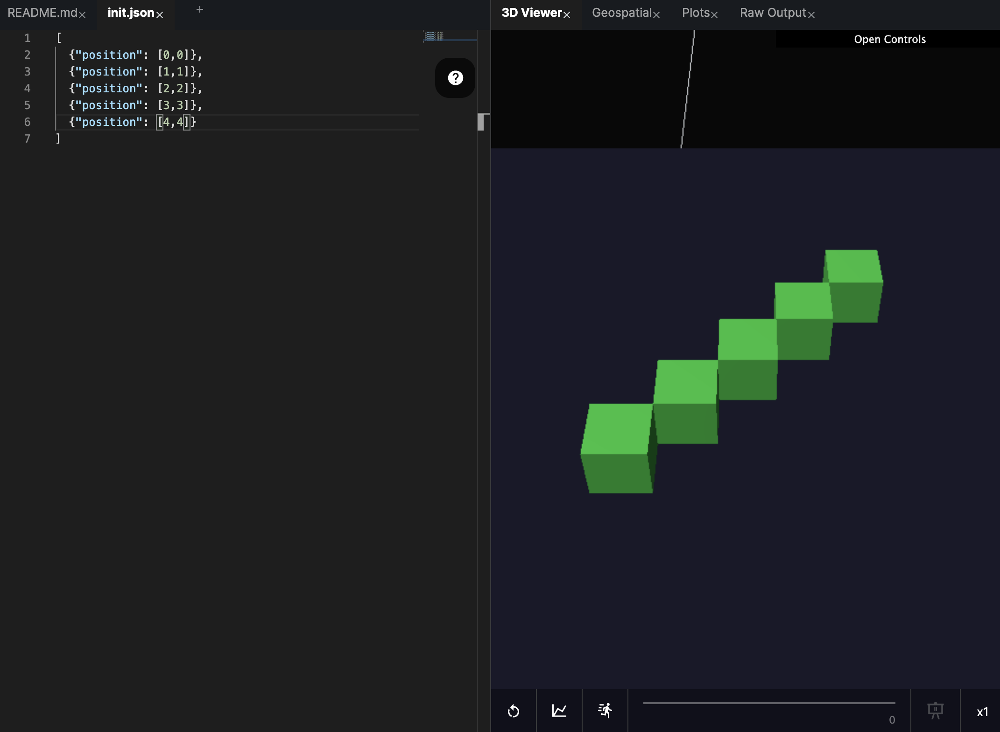
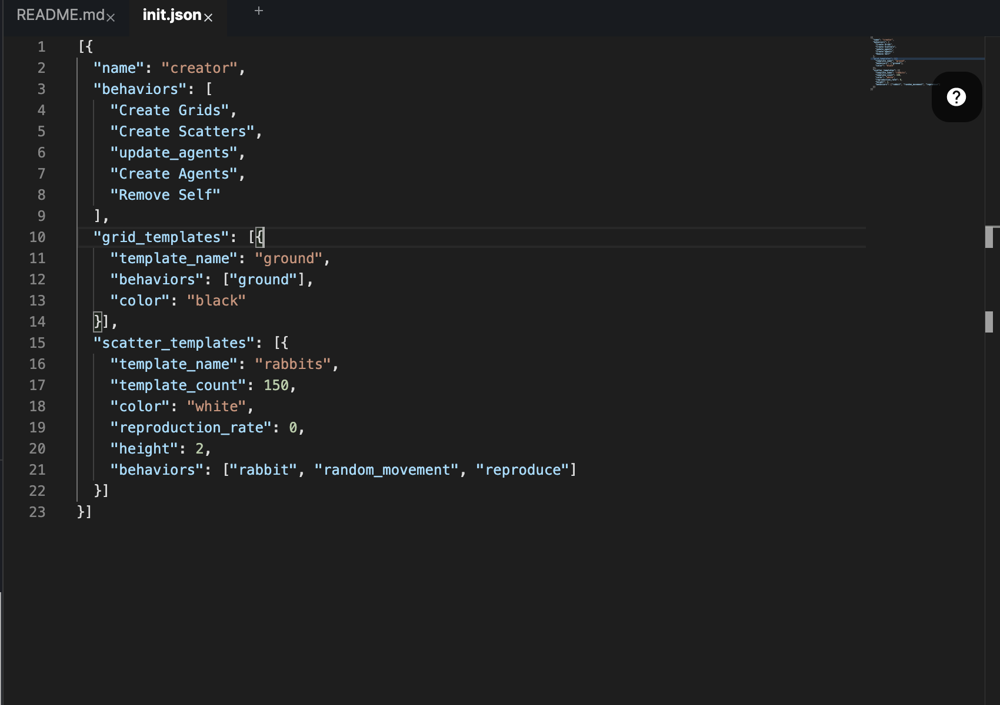
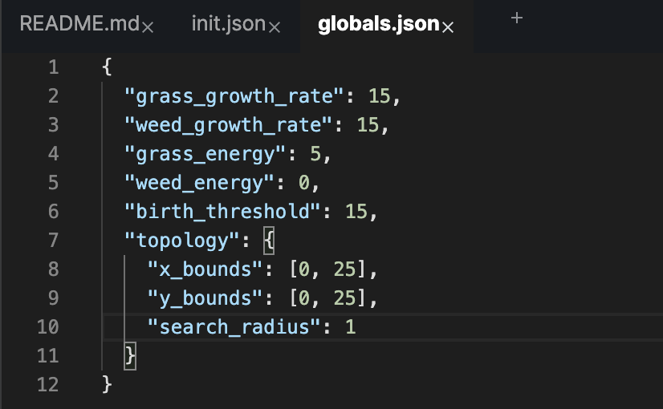
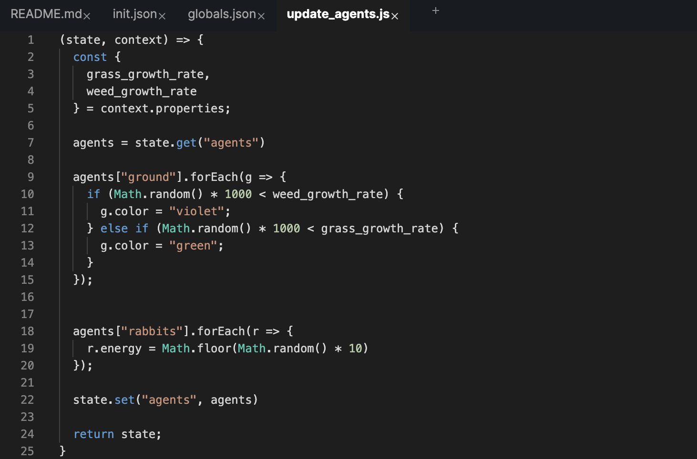

# Initial Agents

All HASH simulations begin life in the `init.json` file found in the root of a HASH project. In this file we generate the starting state, or _initial conditions_ of the simulated world.

There are two ways to populate an `init.json` file. You can:

1. explicitly define the individual agents that will be in your model; or
2. define "creator" agents with behaviors that will generate more complex initial states. You can do this with published behaviors, or create your own.

Here's what explicitly defining your agents might look like:



With "creator" agents you can initialize more dynamic models.


If you want to jump right into code you can take a look at our [Initialization Demo ](https://hash.ai/index/5e7548ed792e5d5adecdb5bd/initialization-demo)which demos creator agents.


For example, by accessing published behaviors, we can very easily generate common agent placements. These behaviors can be found in the lower left corner; click on them to add them to your simulation:

* `Create Grids`:  copy an agent to every unit within the topology bounds
* `Create Scatters`: copy an agent to random locations within the topology bounds 
* `Create Stacks`: copy an agent multiple times to the same location

Take a look at how we can use published behaviors in the following example, where [rabbits forage for food and reproduce](https://hash.ai/index/5e4b6aa3c9c6f7504be4f605/rabbits-grass-weeds), while grass and weeds grow around them:



There's a singly agent, named creator, that has a set of behaviors that will reference the "templates" we attached as properties on the creator agent.

`Create Grids` looks at the agent templates in the "grid\_templates" array, in this case the "ground". We're copying it to fill the space defined in the bounds of our "topology" field in`globals.json`:



Next, `Create Scatters` distributes the "rabbits" across the environment. Each one is placed in a random location within the bounds specified in the `topology`.

Now we want to make a few adjustments to the agents we've generated which requires a bit more logic. Luckily for us, HASH behaviors are composable. `Create Grids` and `Create Scatters` have created "agent" objects in our creator and filled them. We access those agents by using the "template\_name" as a key:



Here we've randomly assigned the color of our "ground" agents, and given each of the "rabbits" a random starting amount of energy.

Our creator then runs two more published behaviors. `Create Agents` sends messages to the engine to generate every agent in the "agents" object, and `Remove Self` gets rid of the "creator" agent, since it's finished all it needs to do. Again, these behaviors can be found in the lower left sidebar.


You can create new agents during your simulation by sending a message to the reserved hash keyword.




```javascript
state.addMessage("hash", "create_agent", {
    ...agent_details
 })
```



```python
state.add_message("hash", "create_agent", {
    ...agent_details
 })
```



If you'd like to explore another simple example that uses these published behaviors, take a look at the [Wildfires](https://hash.ai/index/5de534020860d432cb408b92/wildfires-regrowth) or [Rock, Paper, Scissors](https://core.hash.ai/simulation/5e7a44d2d945ef3e5d54bd55) simulations.


If you ever feel like you might be "re-inventing the wheel," make sure to check out [hIndex](https://hash.ai/index/search?contentType=Behavior&sort=relevance&query=create&page=1) in case someone else has shared a similar behavior.


