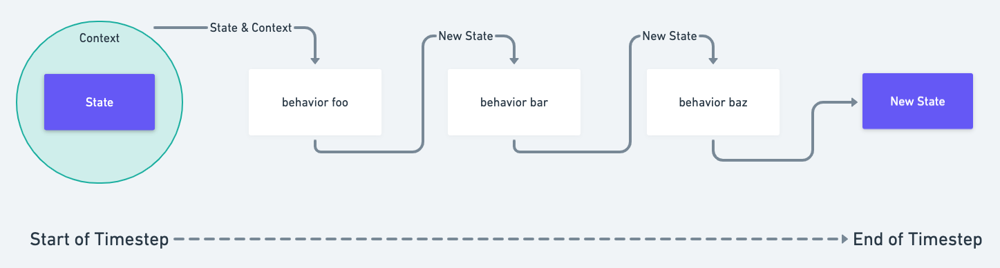

# Behaviors

Agents can \(and typically do\) have behaviors:

```javascript
{
    ...
    behaviors: ['eats_fruit', 'messages_friends_about_fruit', 'has_friends']
}
```

Behaviors allow agents to have _agency_ in the simulation. An agent can have any number of behaviors.

Behaviors are pure functions in the form of: `(current_state, context) => [next_state]`

The exact semantics vary by programming language, but in spirit every behavior is a pure function which receives a given agent's state, the world context visible to that agent, and outputs its next state.



Most behaviors output a single state with the same `agent_id` as they received. For example, the following behavior code causes an agent to move along the x-axis:



```javascript
function behavior(state, context) {
    state.modify("position", position => [position[0] + 1, position[1]]);
}
```



```python
def behavior(state, context):
  def behavior(state, context):
    position = state.get("position")
    state.set("position", [position[0]+1, position[1]])
  
```




Agents can use behaviors to create new agents by sending a message to the special `hash` `agent_id`. This is covered more in-depth in [Messages](../agent-messages/handling-messages.md).


### 

