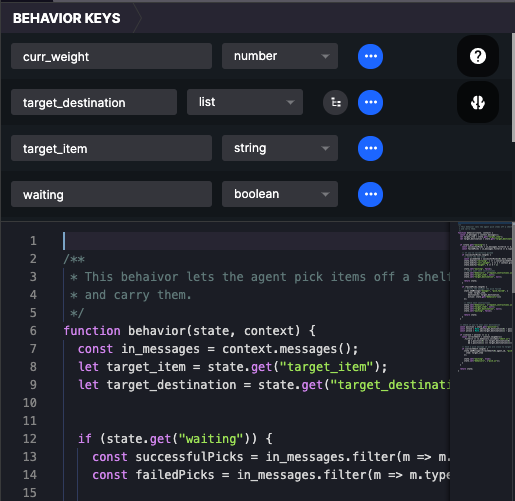

# Behavior Keys

Behavior Keys define the **data** **type** of the fields that a behavior accesses on an agent's state. HASH uses behavior keys to improve the runtime performance of simulations.


Behavior Keys are **optional** for in-browser simulation runs, but are **required** for cloud runs.


If you've used a statically defined language before - like Rust, Go, or Clojure - you're familiar with strong type systems. You select the type - string, number, list, etc. - of data that a field will store. This improves memory allocation and access speed, as well as making sure that if you assign an incorrect type to the field an error is thrown.

Types:

| Type | Example |
| :--- | :--- |
| Strings | "Hello" |
| Booleans | True |
| Numbers \(floats\) | 4.00 |
| Structs \(objects with typed fields\) | {"foo": "bar"} |
| Arrays \(ordered collections containing the same type\) | \[1,2,3\] |
| Fixed-size Arrays | \[1,2,3\] \(max 3 elements\)  |
| Any-type | JS objects, arrays, Python objects, etc |

The any-type designation can apply, appropriately enough, to any data type - it tells HASH to store the value as JSON and deserialize it at runtime. It's a generic that can be used to simplify your behavior key representations, but this will be slower than other type designations, so use it sparingly.

All fields are nullable \(can be assigned the null value/can exist with no value assigned\) by default. You can deselect nullable to make a field non-nullable, which will improve performance and memory.

### Assigning Behavior Keys

In a behavior file, click the brain icon, which is below the help icon, to toggle the behavior keys modal. Define the field the behavior will need to access by putting in the name of the field - the same name as its field name on the agents state object - and the type of the field.

For complex data types - lists, fixed sized lists, and structs, click the tree icon to assign the data types of members of the list or struct.

Data type fields must be the same across behaviors. For instance if field **foo** in behavior A has type: number, field **foo** \(assuming its the same field\) in behavior B must have type: number.


Field Names cannot match built-in fields \(e.g. agentid, position\) and cannot start with double-underscore \(e.g. \_\_age\), which are reserved for engine specific information. 


