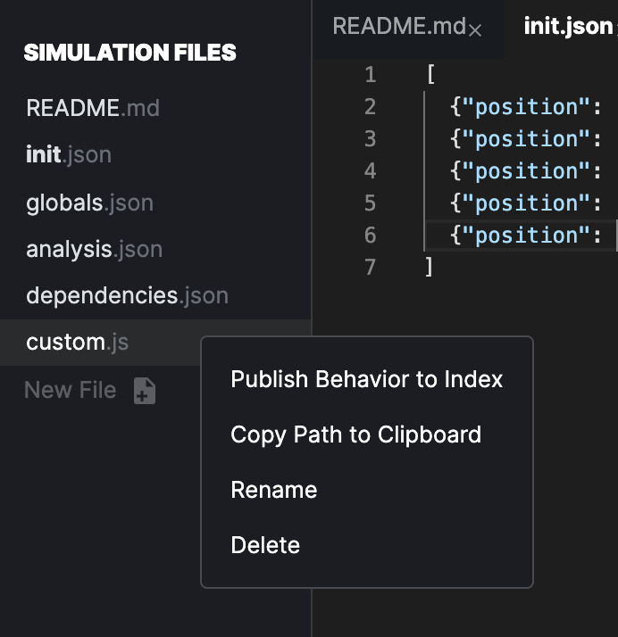

# Composable behaviors

**All user-authored behaviors, regardless of language, are** _**composable**_**.** This means they can be combined in any fashion with any number of others behaviors.

Python and JavaScript behaviors can co-mingle and a single agent can use behaviors programmed in multiple languages by a wide range of people.

**All user-authored behaviors can be shared on hIndex.** Behaviors published in this way can be mapped to schemas for easy-discovery during the agent creation process, and downloaded by anybody with a HASH account.

You can publish by right-clicking on a behavior you've created in the **Simulation Files** sidebar and selecting Publish Behavior to Index.

You can import a behavior by searching in the **Add to Simulation** sidebar, clicking on it and choosing Add to Simulation. Note that if you are using someone's published behavior in your simulation, updates will not automatically be applied to it. This ensures that breaking changes are not introduced to your simulation. You can update at any time by removing and re-adding the behavior.

Whether you're exploring [auction dynamics](https://hash.ai/index/5e864383eb2a71233b2fe0c5/english-auction), [supply](https://hash.ai/index/5e869db7eb2a7155562fe107/supply-chain-fulfill) [chain](https://hash.ai/index/5e869e1aeb2a71b0fa2fe109/supply-chain-calculate-order) [risk](https://hash.ai/index/5e869d61eb2a71504e2fe105/supply-chain-intake), or simply hoping to make your agent [self-destruct](https://hash.ai/index/5e71039b050bd5fa5f42790c/remove-self), there are a broad range of pre-built behaviors readily accessible on Index, and we'd love you to contribute your own!

We attempt to match all behaviors published in the hIndex to the types of '[Things](https://hash.ai/index/schemas/Thing)' that can exhibit them. These 'Things' are types in a schema that in the context of behaviors may represent actions whcih agents might take, or types of agents themselves \(e.g. individuals, households, or companies\). Schema-mapping behaviors enables other modelers to quickly identify them as relevant to the type of action or agent they're seeking to replicate, and dramatically speeds up the process of simulation creation.

