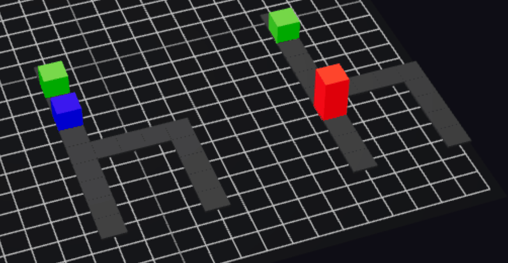
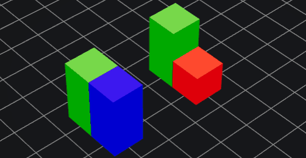

# Designing with the Material Handling Libraries

When designing simulations, you might want certain agents to be able to manipulate other agents. Picking up, moving, and placing agents is an extremely common task in warehouse models, and many others. The Material Handling Libraries make it easy for you to import and extend these capabilities into your simulations.

Each Library provides behaviors for a certain class of "handling" agent: conveyors, cranes, racks and forklifts. Each Library contains a detailed Readme describing how to use the behaviors, and initializes a simple example to demonstrate the functionality.

## Conveyors

Conveyors allow agents to be transported from one location to another. A conveyor system is composed of multiple Conveyor agents.



## Cranes

Cranes are able to pick up and place agents in a new location. Cranes are able to freely move above other agents, but are constrained to travel within a certain area. This Library allows you to create two different types of cranes: **Jib** and **Overhead** cranes.  You can learn more about the Crane Library at the link below:



## Racks

Racks are able to store objects or agents in them. This Library allows you to initialize racks, and give other agents the ability to place or pick from them. For instance, you can create forklifts using the "pick.js" and "place.js" behaviors in this library. You can learn more about the Rack Library at the link below: 



