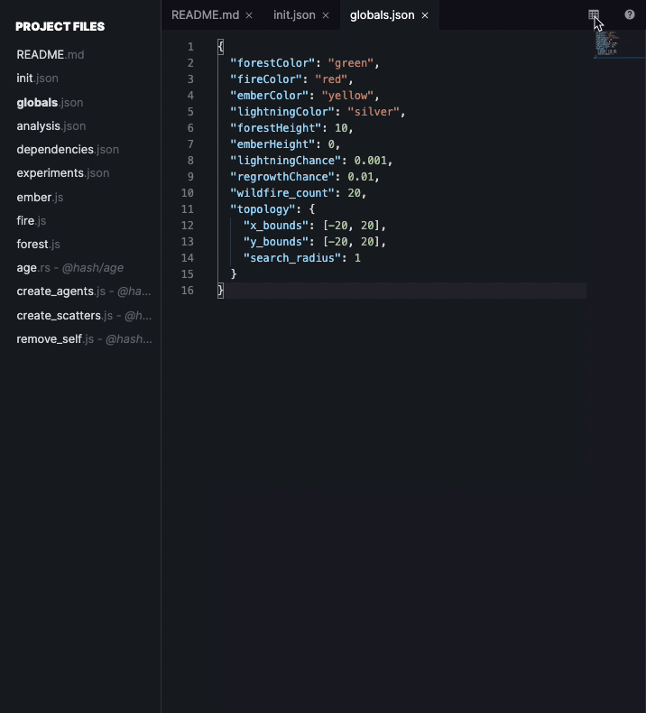
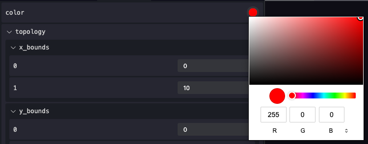

# Simulation Parameters

Global variables are defined in the `globals.json` file present within every simulation. These variables are immutable while the simulation is running and are accessible to all agents simultaneously.

Accessing the properties of the simulation is as simple as using the `context.globals()` function in our agent behavior.

To change properties while the simulation is running, make sure to pause the simulation, make the appropriate changes, and resume.

If, for example, we wanted to cap the height of all trees in a [forest simulation](https://hash.ai/index/5e065650196c3fbd41d8bd43/forest), we might introduce the global variable `"maxTreeHeight"`. The `globals.json` file would contain something like:

```javascript
{
    "maxTreeHeight": 50,
    ...
}
```

The associated tree growth behavior would follow:



```javascript
function behavior(state, context) {
    ...
    if (state.height + growth <= context.globals().maxTreeHeight) {
        growtree()
    }
    ...
}
```



```python
def behavior(state, context):
    ...    
    if state.height + growth <= context.globals()['maxTreeHeight']):
        growtree()
    ...

```



## Visual Globals

You can view and modify the parameters in `globals.json` either as code or as a form, with customizable inputs. Click the toggle visual globals button at the top right of the code editor pane.



You can customize the type of field input for a global variable by adding a "schema" property to globals.

```javascript
  //globals.json
  //adds a color picker selector to the color property
  {
    "color": "#ff0000",
    "schema": {
      "properties": {
        "color": {
          "type": "string",
          "enum": "colors"
        }
      }
    }
    //...more properties
  }
```

This would be rendered in the visual globals as:



Currently visual globals supports:

* Color Picker: 

```javascript
      "properties": {
        "[property name]": {
          "type": "string",
          "enum": "colors"
        }
      }
```


By default a non-signed in viewer of a simulation will see and interact with the visual globals view.


