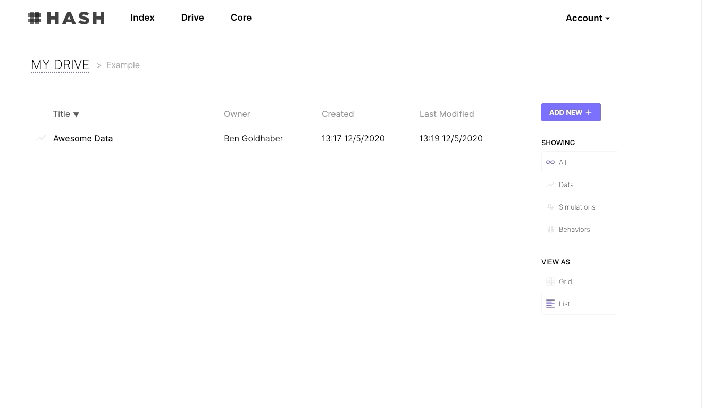
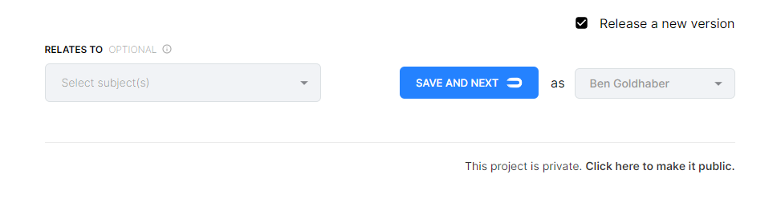
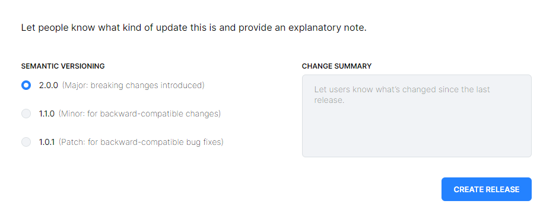

# Publishing Datasets

You can share your datasets with others by publishing them to Index.

To publish a Dataset, visit your profile, select the data you want to publish, and click Edit Project.



From the Edit Project modal add descriptions, keywords, and schemas to your data.


Release a new version and click public at the bottom of the modal.



Finally add semantic versioning details and create a release.



The dataset will be referenced in a simulation as:

```text
"@[user-handle]/[short-name]/[dataset].[csv/json]"
```

## Publishing as an organization

If you're part of an organization, you can publish the dataset on behalf of that organization. To create a new organization go to [HASH.ai &gt; Account &gt; Orgs](https://hash.ai/account/orgs). From there you can view the organizations you're a member of and create new ones. When you publish a dataset in a simulation it will be referenced as:

```text
"@[org-handle]/[short-name]/[dataset].[csv/json]"
```

