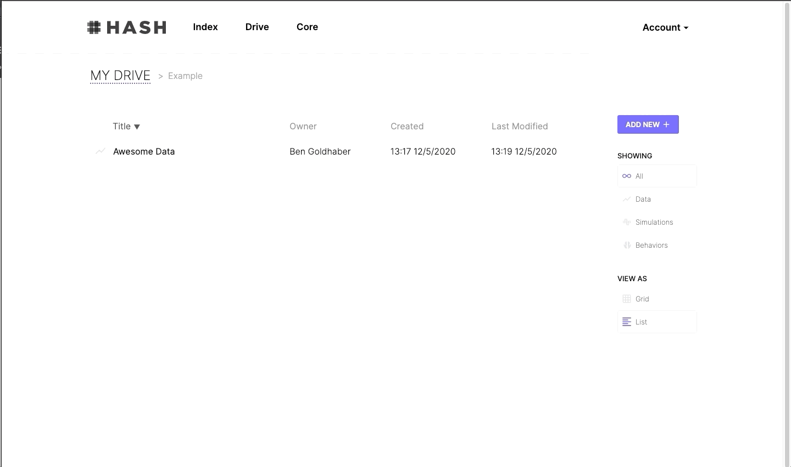
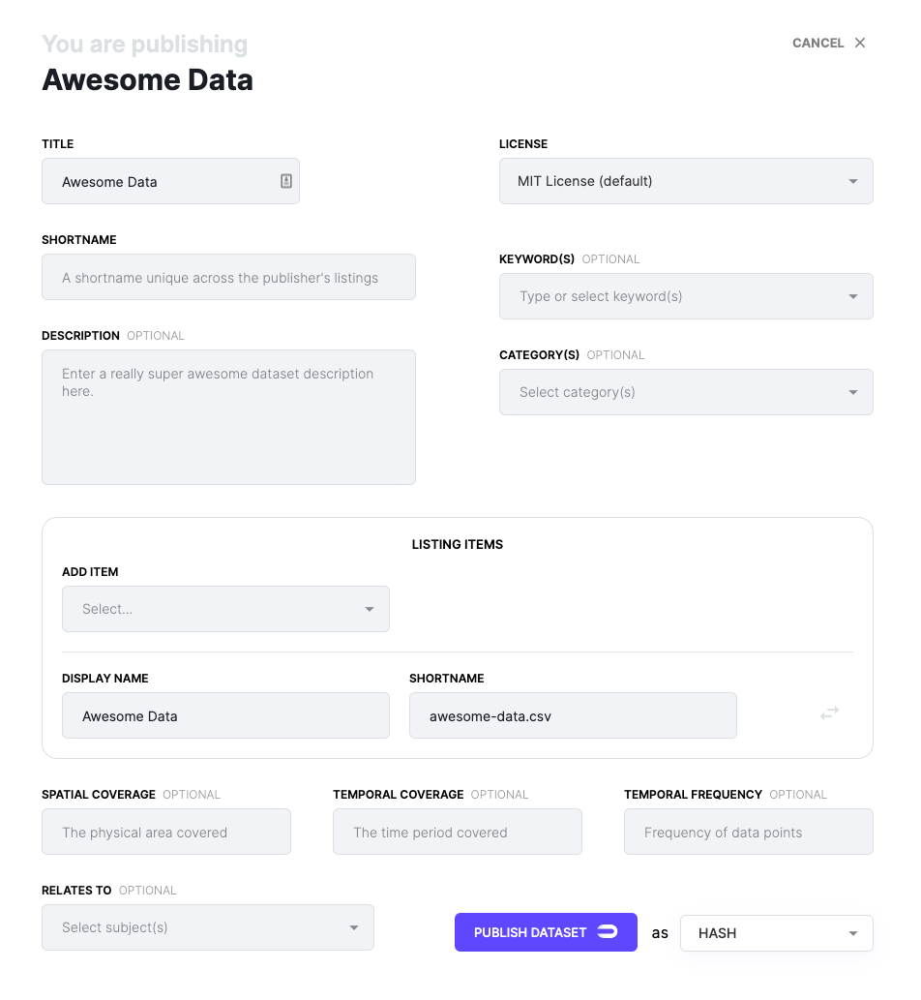

# Publishing Data to Index

You can share your datasets with others by publishing them to Index.

To publish a Dataset, visit your Drive, select the data you want to publish, and click publish.



From the publish modal add descriptions, keywords, and schemas to your data.



The data will be referenced in a simulation as:

```text
"@[user-handle]/[short-name]/[dataset].[csv/json]"
```

## Publishing as an organization

If you're part of an organization, you can publish the dataset as an org.

```text
"@[org-handle]/[short-name]/[dataset].[csv/json]"
```


