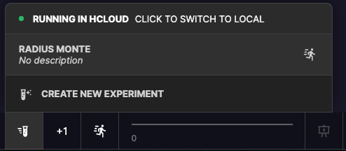

# hCloud

_hCloud is currently in limited release._ [_Please apply for early access._](https://sohostrategy.typeform.com/to/JftFRbaN)\_\_

You can run **hCore** in different environments: inside your browser, and on our cloud platform **hCloud**. 

| Use Case | Browser | Cloud |
| :--- | :--- | :--- |
| Stage of Development |  Prototyping | Running Experiments or Large Simulations |
| Number of Agents | 100-1,000 | 10,000+  |
| Pricing | Always Free | Free tier + Subscription Membership |

## How To Use hCloud

Toggle the execution environment by clicking the toggle at the top of the Experiments button.

Your browser will establish a web socket connection to our servers. Once a connection has been established you can run experiments in the cloud in the same way as if you were running them locally.


Connecting to hCloud does **not** count against your accounts cloud minutes. Only the time spent running simulations or experiments.


### hCloud Compute Minutes

hCloud resources are billed through a composite metric, hCloud Minutes/Seconds. Currently this is calculated as the amount of time spent executing a simulation on an hCloud server per CPU. By default all simulation runs use a single CPU.

Lets take a look at two examples:

1. I'm building a simulation and I want to try to run a larger simulation with more agents than I can do it on my local machine. I've set the number\_of\_agents in my globals, so I create an experiment with 10x the number and then toggle the Cloud Runner button to connect to cloud and run the experiment for 100 steps.  Each execution of a run, from start to finish, will count towards your cloud minute \(not including connect/upload/download times\). If it takes about a second to generate a state for this simulation the total billed time would be 100 cloud seconds. 
2. After iterating on my simulation I'm confident the underlying logic is correct and I'm ready to start exploring the effect of different parameters on the outcomes of simulations. I create a linear space [experiment](experiments/) that will sample ten times from a range of 1 to 100, and will run for 500 time steps. This creates ten separate simulations that each run for around 50 seconds to 60 seconds.  In this example the total time used would be between 8.3 to 10 minutes.

