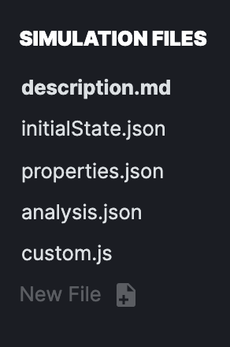
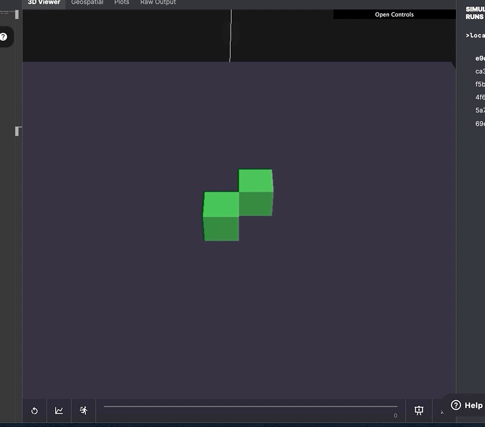
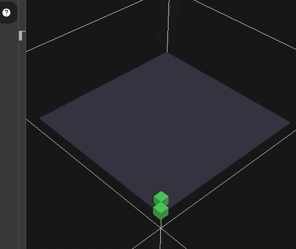

# Hello, HASH!

## Getting started with HASH

We're going to create a basic agent based model where two agents will exchange pleasantries. 

To start, create a new simulation file from scratch by using the _File_ menu and clicking _New Simulation._

In your new simulation workspace, open the **init.json** file ****shown in the lefthand side panel. You'll see an empty pair of square brackets.

The **init.json** file defines the 'initial state' or starting point of a simulation as a collection of objects in a JSON array.

We'll begin by adding two agents into the array, and give them names.

```javascript
[ 
  { 
    "agent_name": "Alice" 
  },
  { 
    "agent_name": "Bob"
  } 
] 
```

_`"agent_name"` is a_ [_reserved keyword on agents_](https://docs.hash.ai/core/anatomy-of-an-agent) _that lets us reference a specific agent by a string._

Click the **Start Simulating** button beneath the workspace's right-hand view-pane, and then select the raw output tab in the viewer. Congratulations! You've given life to Alice and Bob. 

However, if you toggle back from the raw output view to the 3D viewer, you may notice... nothing at all. Alice and Bob haven't been rendered, because they haven't been given a position in space. Let's go ahead and fix that.

```javascript
[ 
  { 
    "agent_name": "Alice", 
    "position": [0,0] 
  },
  { 
    "agent_name": "Bob", 
    "position": [2,0] 
  }
] 
```

When you've finished adding positions to your agents, click **Reset Simulation**. You should now see two blobs in the 3D viewer representing our agents.

### Saying Hello

Alice and Bob aren't very interesting right now. Let's teach them some manners. We can give the agents [behaviors](https://docs.hash.ai/core/behaviors) that enable them to act more interestingly, and respond to each other as well as their environment. In **init.json** let's add some file names into each of the behavior arrays.

```javascript
[
  { 
    "agent_name": "Alice", 
    "behaviors": ["hello_alice.js"],
    "position": [0,0] 
  }, 
  { 
    "agent_name": "Bob", 
    "behaviors": ["hello_bob.js"],
    "position": [2,0] 
  }
] 
```

We can then create corresponding behavior files by clicking the **New File** button in the left hand files sidebar.



In **hello\_bob.js**, we want to send a message **from** Bob **to** Alice. 

HASH has built in support for message passing. Push a message object to an agent's message array, and it will deliver the message to the target agent in the next timestep. We need to add three things to our message.

* `to`: the `agent_id` or an `agent_name`
* `type`: a string that identifies the type of message that is being sent
* `data`: a JSON object containing the message data

Since we're only sending a message to one agent, Alice, we can use her `agent_name` in the `to` field. Let's call this type of message a "greeting", and add a friendly greeting in the data payload.

```javascript
function behavior(state, context) {
  state.addMessage({
      to: "Alice",
      type: "greeting",
      data: {
        msg: "Hello, Alice."
      }
    })
  return state;
}
```

Now lets click **Run Simulation**. You won't see anything happen in the 3D viewer, but if you click Raw Output you'll see our Bob agent now has an array of messages with one message to Alice. _Bob is sending this same message every timestep._ 

In our **hello\_alice.js** function, we want to ensure Alice knows how to handle messages she receives. When an agent receives a message addressed to them, it's stored in their "context", under `context.messages`. Agents can iterate through their messages array and act on specific messages.

Let's find all of the messages that are greetings:

```javascript
const greetings = context.messages().filter(msg => msg.type == "greeting");
if (greetings.length > 0) {
    //do something
}
```

Adding visual indicators of state changes is an easy way to communicate what's happening in your simulation. We're going to change Alice's color when receiving a greeting:

```javascript
function behavior(state, context) {
  const greetings = context.messages().filter(msg => msg.type == "greeting");
  if (greetings.length > 0) {
    state.set("color", "blue");
  }
  return state;
}
```

Now **reset** your simulation and **run** it. On the second timestep you should notice that Alice's agent changes color to blue. Neat!

To respond to Bob's greeting, we can send a message back addressed to the first message sender, with an appropriate response.

```javascript
function behavior(state, context) {
  const greetings = context.messages().filter(msg => msg.type == "greeting");
  if (greetings.length > 0) {
    state.set("color", "blue");
    greetings.forEach(m => {
    state.addMessage({
        to: m.from,
        type: "greeting",
        data: {
          msg: "Go away, I’m social-distancing!"
        }
      })
    })
  }
  return state;
}
```

Here we're iterating through filtered messages and pushing a new message to Alice's message array, addressed to whichever agent sent the message, 'greeting' them back.

Over in **hello\_bob.js**, we can add a similar message handler for Bob, too. 

```javascript
function behavior(state, context) {
  const greetings = context.messages().filter(msg => msg.type == "greeting");
  if (greetings.length > 0) {
        state.set("color", "red");
  }
  state.addMessage({
    to: "Alice",
    type: "greeting",
    data: {
      msg: "Hello, Alice."
    }
  })
  return state;
}
```

**Reset** and **run** your simulation once again. Alice and Bob turn blue and red, respectively, after they receive the others greeting.

It's a little boring to just have them stay red and blue throughout the rest of the simulation. We can help visualize better what's going on in the simulation by having both agents flip colors whenever they receive a new message. The logic we want isL

```javascript
    color = color == "blue" ? "green" : "blue"
```

or:

```javascript
    color = color == "purple" ? "red" : "purple"
```

We'll need to refactor our code slightly to implement this - instead of using state.set\("color", "blue"\) we'll first get the field value and assign it to a variable, color, and then set the field as the variables value at the end of the behavior file \(a common pattern in HASH simulations\).

```javascript
function behavior(state, context) {
  const greetings = context.messages().filter(msg => msg.type == "greeting");
  let color = state.get("color")
  if (greetings.length > 0) {
    color = color == "purple" ? "red" : "purple"
  }
  state.addMessage({
    to: "Alice",
    type: "greeting",
    data: {
      msg: "Hello, Alice."
    }
  })
  state.set("color", color)
  return state;
}
```



Finally, since Alice clearly would like some socially-responsible distance from Bob, we can add movement to the agents. I'm going to use a shared behavior @hash/random\_movement.rs , to let each agent will move about the environment at random. I'll import the behavior from the HASH Index, and then add the file name to each agent.


```javascript
[ 
  { 
    "agent_name": "Alice",
    "behaviors": ["hello_bob.js", "@hash/random_movement.rs"], 
    "position": [0,0] 
  },
  { 
    "agent_name": "Bob", 
    "behaviors": ["hello_alice.js", "@hash/random_movement.rs"], 
    "position": [2,0] 
  }
] 
```

To prevent our agents from straying too far, we can set [bounds](https://docs.hash.ai/core/configuration/topology/bounds-and-wrapping) on their environment in the `globals.json` file as follows:

```javascript
{
    "topology": {
        "x_bounds": [0, 20],
        "y_bounds": [0, 20]
    }
}
```



