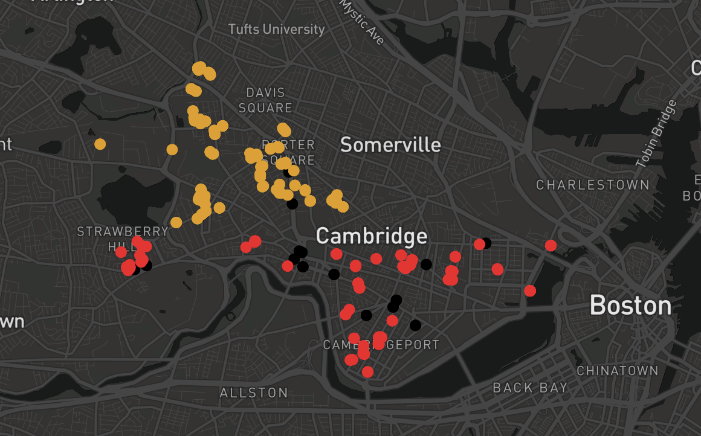

# Building the Local Competition Model

**Model Overview**

This model aims to simulate local businesses competing for customers based on location and price. Originally based on the [Hotelling model](http://www.math.toronto.edu/mccann/assignments/477/Hotelling29.pdf) which analyzed the optimal locations of businesses along a one-dimensional line, HASH’s aims to extend this model by incorporating real-life spatial data. You can use this model to predict which location would be the most profitable for a business to open.

In this walkthrough, we will show you how the Local Competition model was created as well as how to break down an agent-based model into phases of increasing complexity. 

* **Phase 1** - Building a simple Hotelling model in 2D
* **Phase 2** - Introduces more realistic behavior for businesses and customers, and creates a more realistic environment 
* **Phase 3** - Add real world data 

**Agents Overview**

* **Customer -** attempt to minimize a cost function that includes both a price and distance component. 

$$
Min(C(B_i))=Min(price_i+D(position_i))
$$

* **Business -** attempts to maximize their profit. Before moving or changing their price they gather information from customers about where they would choose to shop under the new conditions. Businesses send messages informing Customers of a potential change. Based on purchasing patterns in what the Customer agent responds with, Businesses will decide what \(if any\) changes to make.
* **Location -** represent lots/storefronts that Businesses may occupy in the environment. Each Location agent has a square footage size and rent cost.

