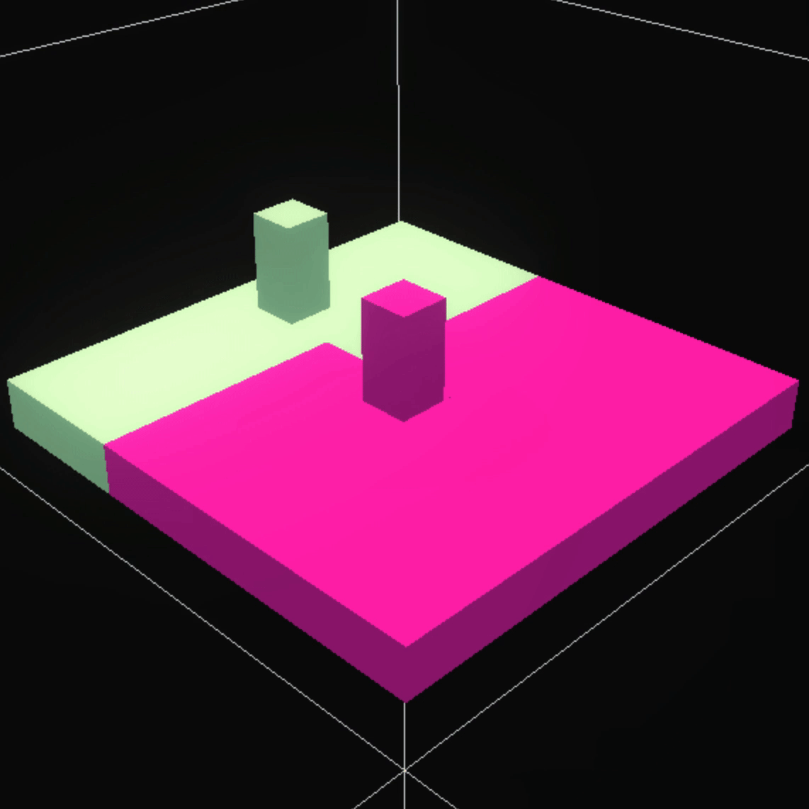

# Building a Simple Hotelling Model in 2D

This model aims to simulate local businesses competing for customers based on location and price. Originally based on the [Hotelling model](http://www.math.toronto.edu/mccann/assignments/477/Hotelling29.pdf) which analyzed the optimal locations of businesses along a one-dimensional line, we'll use HASH to build it in a 2D space.

This model demonstrates some basic principles around spatial and price competition.

