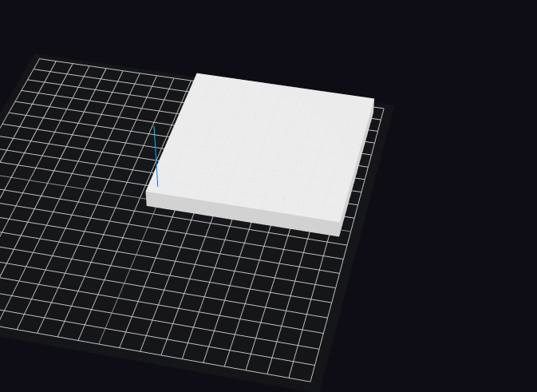

# Agent Initialization

Now, open up init.json. This is where we will be writing our ****[**agent creator**](https://docs.hash.ai/core/anatomy-of-an-agent/initial-state) ****that will generate all our simulation agents. First, generate the Customer agents. 

1. Look at the lower left of screen and locate the Add to Simulation sidebar. 
2. Click on the search bar located under the title and type “Create grids”.
3. Select the **Create Grids** result and choose Add to Simulation.
4. Repeat steps 2-3 for **Create Agents** and **Remove Self**.

Customers begin evenly distributed in a grid across the environment. Thanks to HASH’s published behavior feature, this can be easily done by pulling the **Create Grids** behavior \(shortname: @hash/create-grids/create\_grids.js\) into our Simulation Files. This will populate our agent creator’s agents field with Customer agents we define in our grid\_templates field. **Create Agents** \(shortname: @hash/create-agents/create\_agents.js\)will then populate the environment with our agents. **Remove Self** \(shortname: @hash/remove-self/remove\_self.js\) will remove the creator agent from the simulation after all agents have been initialized.



```text
[
    {
        "behaviors": [
            "@hash/create-grids/create_grids.js",
            "@hash/create-agents/create_agents.js",
            "@hash/remove-self/remove_self.js"
        ],
        "agents": {},
        "grid_templates": [
            {
                "template_name": "grid",
                "height": 1,
                "rgb": [
                    255,
                    255,
                    255
                ],
                "behaviors": [
                    "customer.js"
                ]
            }
        ]
    }
]
```



With the Customer agents outlined in init.json, we now need to create the customer.js behavior. Don’t worry about writing the behavior at the moment, we’re just looking to create the file. Select New File under Simulation Files and create customer.js \(or right-click on custom.js and choose to rename the file to customer.js\). 

Now click Reset Simulation and Run Simulation at the bottom of the 3D Viewer. You should see a grid of white agents!



Now to create Business agents:

1. Add the published behavior **Create Scatters** to Simulation Files.
2. Create two new files - business.js and update\_businesses.js.
3. Add the business scatter template and the two behaviors  \(@hash/create-scatters/create\_scatters.js and update\_businesses.js\) to the agent creator agent \[see image below for code changes\]



```text
[
    {
        "behaviors": [
            "@hash/create-grids/create_grids.js",
            "@hash/create-scatters/create_scatters.js",
            "update_businesses.js",
            "@hash/create-agents/create_agents.js",
            "@hash/remove-self/remove_self.js"
        ],
        "agents": {},
        "grid_templates": [
            {
                "template_name": "grid",
                "height": 1,
                "rgb": [
                    255,
                    255,
                    255
                ],
                "behaviors": [
                    "customer.js"
                ]
            }
        ],
        "scatter_templates": [
            {
                "template_name": "businesses",
                "template_count": 2,
                "height": 3,
                "item_price": 10,
                "behaviors": [
                    "business.js"
                ]
            }
        ]
    }
]
```




Since our agent creator is first defined in init.json, which, as a JSON file can't run JavaScript, any agent fields that need to be populated using an imported package \(such as Python math and random\), Javascript object, or HASH global value needs to be updated in a separate behavior file \(i.e. update\_behavior.js\).


We’re going to update the rgb value of each Business to a random color in update\_businesses.js. 


Read more about [accessing and setting state](https://docs.hash.ai/core/anatomy-of-an-agent/state#getting-and-setting-state)**.**




```javascript
const behavior = (state, context) => {
    state.agents["businesses"].map((b) => {
        b.rgb = [Math.random() * 255, Math.random() * 255, Math.random() * 255];
    })
}
```



Now after hitting Reset and Run, the Customer agents should reappear along with two taller Business agents with randomized colors**.**

Both agents are now initialized! Time to move onto building out the business.js and customer.js behaviors. First let's look at the business.js file.

