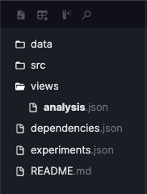

# Plots

## What are Plots?

Plots allow you to learn more about your simulation. For instance:

* Is a certain variable converging upon a value? 
* What emergent phenomena are appearing? 
* How do stochasticity and the initial conditions affect the simulation run?

We currently support five different types of Plots. Their syntax and intended usage are described below. 

## How can I create Plots?

There are two ways to create Plots. You can either use our Create new plot wizard or alternatively, you can edit the analysis.json file directly.

#### Using the Create new Plot wizard

1. Navigate to the Analysis tab
2. Click on the Create new Plot wizard
3. Select the plot type you want to create
4. Fill in the rest of the required information
5. Click "Create new plot"

#### Modifying the analysis.json file

1. Focusing on the left sidebar, you'll find a folder called **views**
2. Expand this folder by clicking on it
3. Click on the **analysis.json** file
4. Edit the file on the left pane. Your changes will be saved after you finish typing.

## Histograms

**Histograms** are used to summarize discrete or continuous data. It works by displaying the number of data points that form part of a group, also called "bins". They are similar to vertical bar graphs.

## Area

**Area** plots are used to depict a time-series relationship. They allow you to visualize the sum value of metrics, which is harder to discern with a standard line plot. 

## Box

 **Box** plots are a way of displaying the distribution of data based on five different summaries:

* Minimum
* First quartile \(Q1\)
* Median
* Third quartile \(Q3\)
* Maximum

It can also tell you if your data is symmetrical, how it is grouped, and if and how your data is skewed

## Line

**Line** plots are graphs that display data as points above a number line, showing the frequency of each value. In essence, they are like a scatter plot whose points are sequentially connected.

## Scatter

**Scatter** plots primary uses are to observe and show relationships between two numeric variables. It helps you to detect trends in the data. 

## Extra tips

Each plot provides extra functionality to interact with it. You need to hover the plot to see them. Here's what they mean:

1. Download as PNG
2. Select Zoom mode
3. Select Pan mode
4. Zoom in
5. Zoom out
6. Autoscale
7. Reset Axes
8. Toggle spike lines
9. Show the closest data on hover
10. Compare data on hover.

